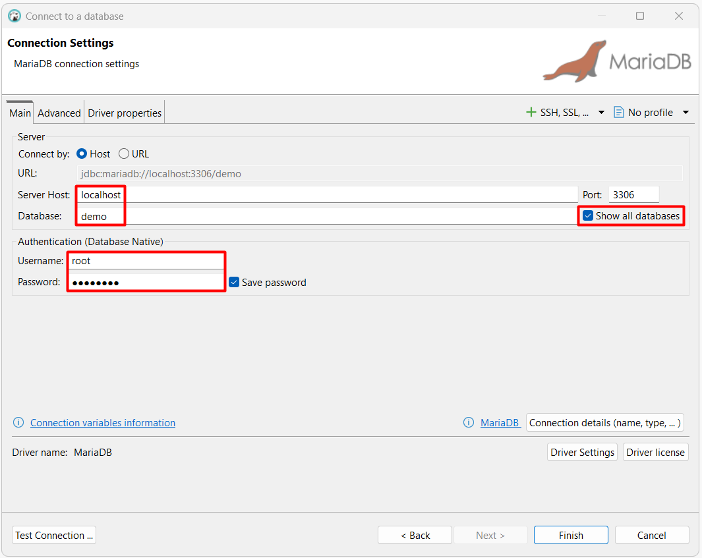

# notes-sql / mariadb

- [Documentación oficial](https://mariadb.com/kb/en/documentation/)
- "Cheat Sheet"
  - [LearnSQL.com](https://learnsql.com/blog/mysql-cheat-sheet/mysql-cheat-sheet-letter.pdf)
  - [tutorialspoint.com](https://www.tutorialspoint.com/mariadb/index.htm)
  - [geeksforgeeks.org](https://www.geeksforgeeks.org/mysql/mysql-tutorial/)

## Docker

- [Guía oficial e Imágenes](https://hub.docker.com/_/mariadb)

### Ejecutar contenedor

El siguiente comando en PowerShell descargan la imagen.

```powershell
docker pull "mariadb:12.0.2"
```

Los siguientes comandos en PowerShell crean y ejecutan el contenedor.

```powershell
#creación de carpeta base
New-Item -ItemType Directory -Force -Path "C:\Docker"

#creación de volúmenes en carpeta base
docker volume create "db-mariadb-data" --opt o=bind --opt type=none --opt device="C:\Docker\db-mariadb-data"

#creación y ejecución del contenedor
docker run --name "db-mariadb" -p 3306:3306 -e "MARIADB_USER=user" -e "MARIADB_PASSWORD=DEMO123*" -e "MARIADB_ROOT_PASSWORD=DEMO123*" -e "MARIADB_DATABASE=demo" -v "db-mariadb-data:/var/lib/mysql" -d "mariadb:12.0.2"
```

### Conectar

DBeaver

<p align="center">
  
</p>

## Base de datos de ejemplo

Los siguientes comandos en PowerShell crean la base de datos de ejemplo Chinook. Se debe descargar y cambiar la ruta del archivo sql.

```powershell
$container='db-mariadb'
$connection_user='root'
$connection_password='DEMO123*'
Get-Content ".\examples\chinook\mariadb.sql" | docker exec -i $container mariadb --user=$connection_user --password=$connection_password
```
