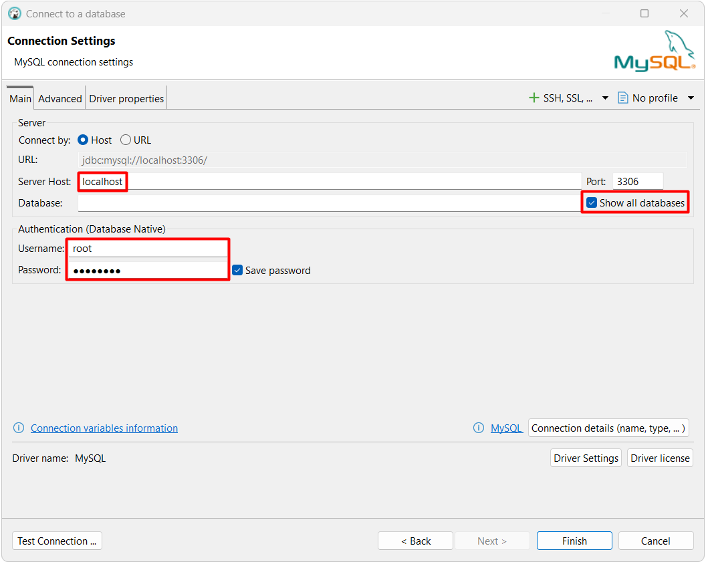
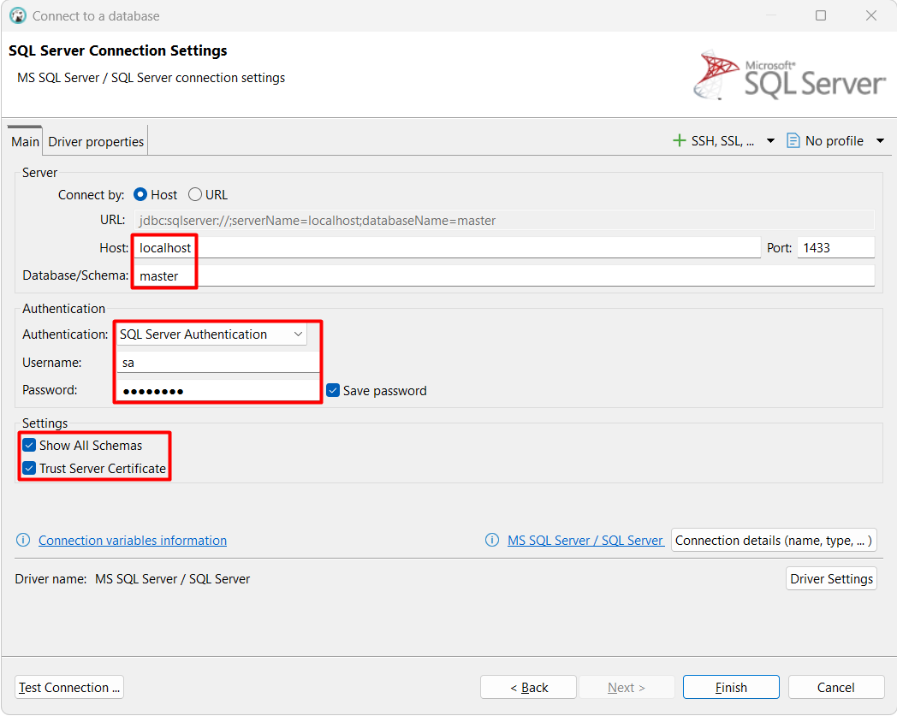

# notes-sql / mssql

- [Documentación oficial](https://learn.microsoft.com/en-us/sql/sql-server)
- Herramientas de administración
  - Management Studio (oficial)
    - [Documentación](https://learn.microsoft.com/en-us/ssms)
    - [Instalador](https://learn.microsoft.com/en-us/ssms/install/install)
    - Extensiones
      - SQL Shades
        - [Documentación](https://www.sqlshades.com/docs/)
        - [Instalador](https://www.sqlshades.com/download/immediate/)
      - SQL Style
        - [Documentación](https://www.stylesql.com/docs/)
        - [Instalador](https://www.stylesql.com/download/)
  - DBeaver (general)
    - [Documentación](https://dbeaver.com/docs/dbeaver/)
    - [Instalador](https://dbeaver.io/download/)
- [Versiones](https://sqlserverbuilds.blogspot.com)
- Tutoriales
  - [LearnSQL.com](https://learnsql.com/blog/sql-server-cheat-sheet/sql-server-cheat-sheet-letter.pdf)
  - [tutorialspoint.com](https://www.tutorialspoint.com/t_sql/index.htm)

## Docker

- [Guía oficial de docker (rápida)](https://learn.microsoft.com/en-us/sql/linux/quickstart-install-connect-docker)
- [Guía oficial de docker (completa)](https://learn.microsoft.com/en-us/sql/linux/sql-server-linux-docker-container-deployment)
- [Imágenes](https://hub.docker.com/_/microsoft-mssql-server)

### Ejecutar

El siguiente comando en PowerShell descargan la imagen.

```powershell
docker pull "mcr.microsoft.com/mssql/server:2025-RTM-ubuntu-22.04"
```

Los siguientes comandos en PowerShell crean y ejecutan el contenedor.

```powershell
#creación de carpeta base
New-Item -ItemType Directory -Force -Path "C:\Docker"

#creación de volúmenes en carpeta base
docker volume create "db-mssql-data" --opt o=bind --opt type=none --opt device="C:\Docker\db-mssql-data"
docker volume create "db-mssql-log" --opt o=bind --opt type=none --opt device="C:\Docker\db-mssql-log"
docker volume create "db-mssql-backup" --opt o=bind --opt type=none --opt device="C:\Docker\db-mssql-backup"
docker volume create "db-mssql-secrets" --opt o=bind --opt type=none --opt device="C:\Docker\db-mssql-secrets"

#creación y ejecución del contenedor
docker run --name "db-mssql" -p 1433:1433 -u 0:0 -e "ACCEPT_EULA=Y" -e "MSSQL_SA_PASSWORD=DEMO123*" -e "MSSQL_COLLATION=Latin1_General_100_CI_AI" -v "db-mssql-data:/var/opt/mssql/data" -v "db-mssql-log:/var/opt/mssql/log" -v "db-mssql-backup:/var/opt/mssql/backup" -v "db-mssql-secrets:/var/opt/mssql/secrets" -d "mcr.microsoft.com/mssql/server:2025-RTM-ubuntu-22.04"
```

### Conectar

Management Studio

<p align="center">
  
</p>

DBeaver

<p align="center">
  
</p>

## Base de datos de ejemplo

Los siguientes comandos en PowerShell crean la base de datos de ejemplo Chinook. Se debe descargar y cambiar la ruta del archivo sql.

```powershell
$container='db-demo-mssql'
$connection_user='sa'
$connection_password='DEMO123*'
Get-Content ".\examples\chinook\mssql.sql" | docker exec -i $container /opt/mssql-tools/bin/sqlcmd -S localhost -U $connection_user -P $connection_password
```
