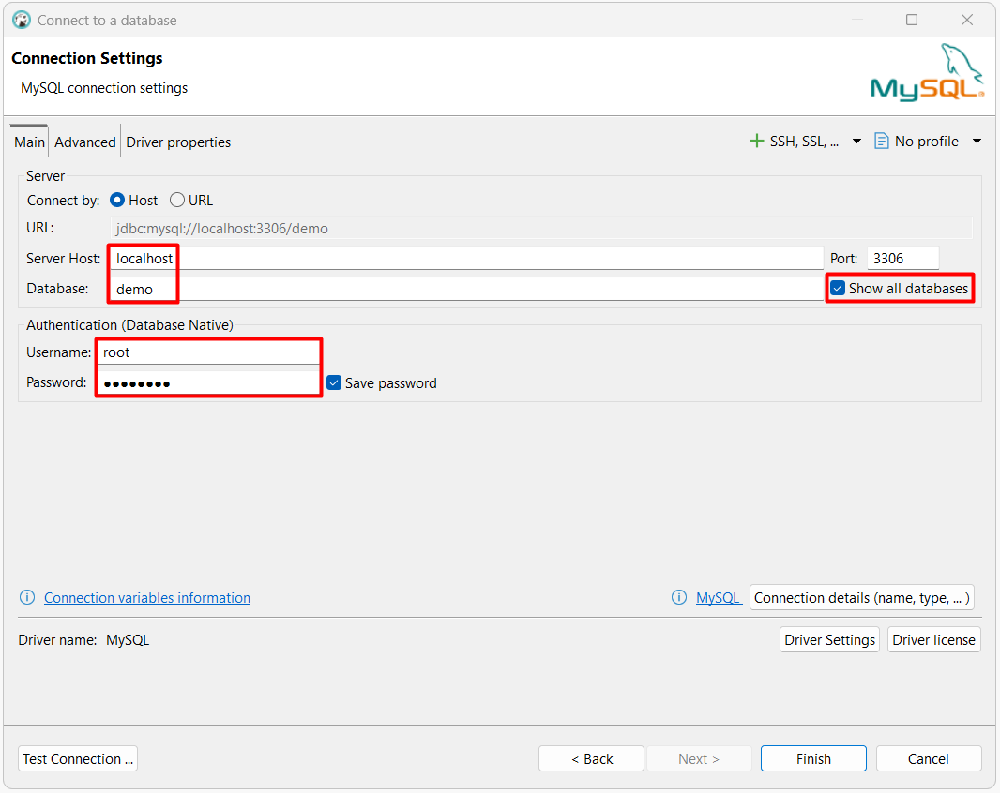

# notes-sql / mysql

- [Documentación oficial](https://dev.mysql.com/doc/refman/9.5/en/)

## Docker

- [Guía oficial e Imágenes](https://container-registry.oracle.com/)

### Ejecutar contenedor

El siguiente comando en PowerShell descargan la imagen.

```powershell
docker pull "container-registry.oracle.com/mysql/community-server:9.5.0"
```

Los siguientes comandos en PowerShell crean y ejecutan el contenedor.

```powershell
#creación de carpeta base
New-Item -ItemType Directory -Force -Path "C:\Docker"

#creación de volúmenes en carpeta base
docker volume create "db-mysql-data" --opt o=bind --opt type=none --opt device="C:\Docker\db-mysql-data"

#creación y ejecución del contenedor
docker run --name "db-mysql" -p 3306:3306 -e "MYSQL_USER=user" -e "MYSQL_PASSWORD=DEMO123*" -e "MYSQL_ROOT_PASSWORD=DEMO123*" -e "MYSQL_ROOT_HOST=%" -e "MYSQL_DATABASE=demo" -v "db-mysql-data:/var/lib/mysql" -d "container-registry.oracle.com/mysql/community-server:9.5.0"
```

### Conectar

DBeaver
<p align="center">
  
</p>

## Base de datos de ejemplo

Los siguientes comandos en PowerShell crean la base de datos de ejemplo Chinook. Se debe descargar y cambiar la ruta del archivo sql.

```powershell
$container='db-mysql'
$connection_user='root'
$connection_password='DEMO123*'
Get-Content ".\examples\chinook\mysql.sql" | docker exec -i $container mysql --user=$connection_user --password=$connection_password
```