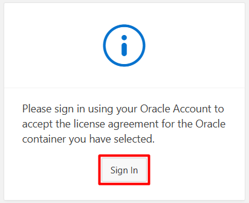
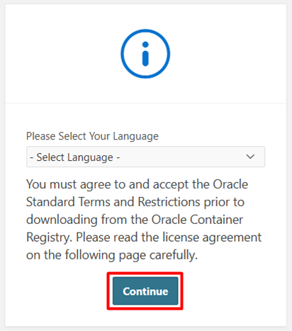
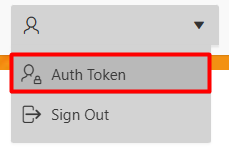
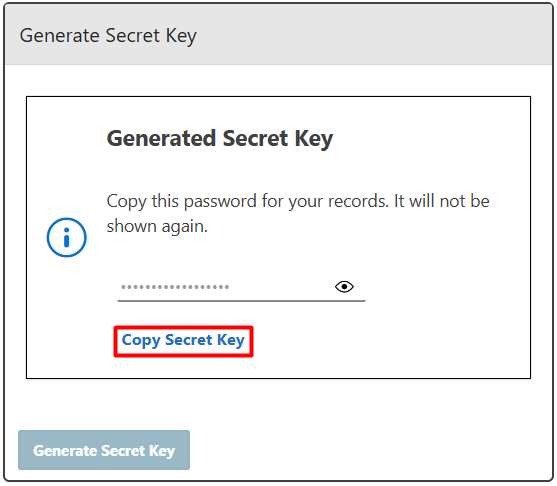
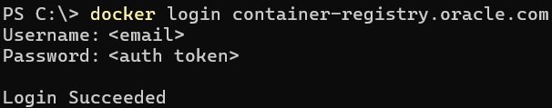
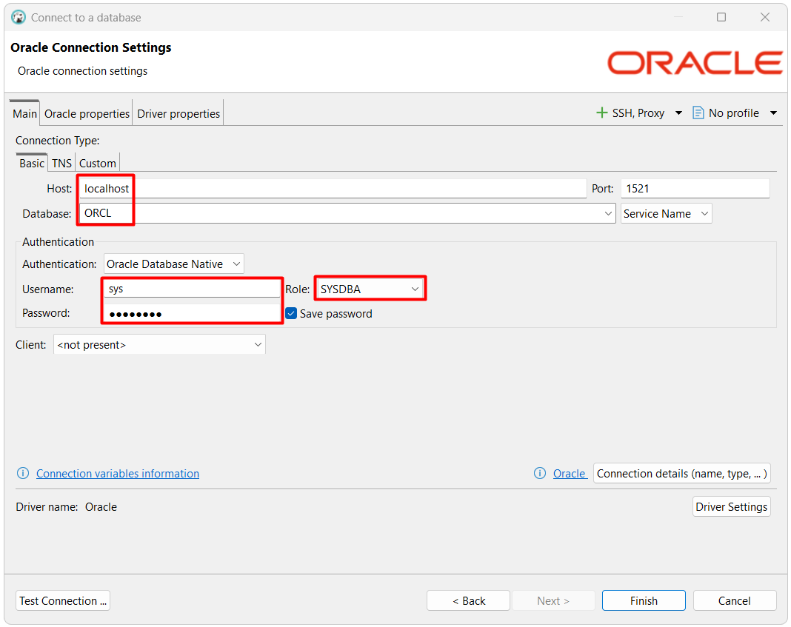

# notes-sql / oracle

- [Documentación oficial](https://docs.oracle.com/en/database/oracle/oracle-database/21/index.html)
- Herramientas de administración
  - [SQL Developer (oficial)](https://www.oracle.com/database/sqldeveloper/technologies/download/)
  - [Basic Package + SQL Plus Package (oficial)](https://www.oracle.com/europe/database/technologies/instant-client/winx64-64-downloads.html)
  - DBeaver (general)
    - [Documentación](https://dbeaver.com/docs/dbeaver/)
    - [Instalador](https://dbeaver.io/download/)
- Tutoriales
  - [cheatsheet.tfix.io](https://cheatsheet.tfix.io/documentation/oracle/)
  - [tutorialspoint.com](https://www.tutorialspoint.com/plsql/index.htm)
  - [geeksforgeeks.org](https://www.geeksforgeeks.org/plsql/pl-sql-tutorial/)

## Docker

- [Guía oficial](https://github.com/oracle/docker-images/blob/main/OracleDatabase/SingleInstance/README.md)
- [Imágenes](https://container-registry.oracle.com)

### Ejecutar contenedor

Para obtener la imagen es necesario autenticarse en la página <https://container-registry.oracle.com/ords/ocr/ba/database/enterprise> y generar un Auth Token, para autenticarse en el docker y permitir la descarga de la imagen.

<p align="center">
  
</p>
<p align="center">
  
</p>
<p align="center">
  
</p>
<p align="center">
  
</p>
<p align="center">
  
</p>
<p align="center">
docker login container-registry.oracle.com
</p>
<p align="center">
  
</p>

El siguiente comando en PowerShell descargan la imagen.

```powershell
docker pull container-registry.oracle.com/database/enterprise:21.3.0.0
```

Los siguientes comandos en PowerShell crean y ejecutan el contenedor.

```powershell
#creación de carpeta base
New-Item -ItemType Directory -Force -Path "C:\Docker"

#creación de volúmenes en carpeta base
docker volume create "db-oracle-data" --opt o=bind --opt type=none --opt device="C:\Docker\db-oracle-data"

#creación y ejecución del contenedor
docker run --name "db-oracle" -p 1521:1521 -p 5500:5500 -e "ORACLE_PDB=ORCL" -e "ORACLE_PWD=DEMO123*" -e "ORACLE_EDITION=enterprise" -v "db-oracle-data:/opt/oracle/oradata" -d "container-registry.oracle.com/database/enterprise:21.3.0.0"
```

### Conectar

DBeaver

<p align="center">
  
</p>

### Base de datos Chinook

Los siguientes comandos en PowerShell crean la base de datos de ejemplo Chinook. Se deben descargar y cambiar la ruta de los archivos sql.

```powershell
$container='db-oracle'
$connection_sys='sys/DEMO123*@//localhost:1521/ORCL AS SYSDBA'
Get-Content ".\examples\chinook\oracle_1_user.sql" | docker exec -i $container sqlplus $connection_sys
Get-Content ".\examples\chinook\oracle_2_tables.sql" | docker exec -i $container sqlplus $connection_sys
Get-Content ".\examples\chinook\oracle_3_data.sql" | docker exec -i $container sqlplus $connection_sys
Get-Content ".\examples\chinook\oracle_4_data.sql" | docker exec -i $container sqlplus $connection_sys
Get-Content ".\examples\chinook\oracle_5_data.sql" | docker exec -i $container sqlplus $connection_sys
Get-Content ".\examples\chinook\oracle_6_identities.sql" | docker exec -i $container sqlplus $connection_sys
```
