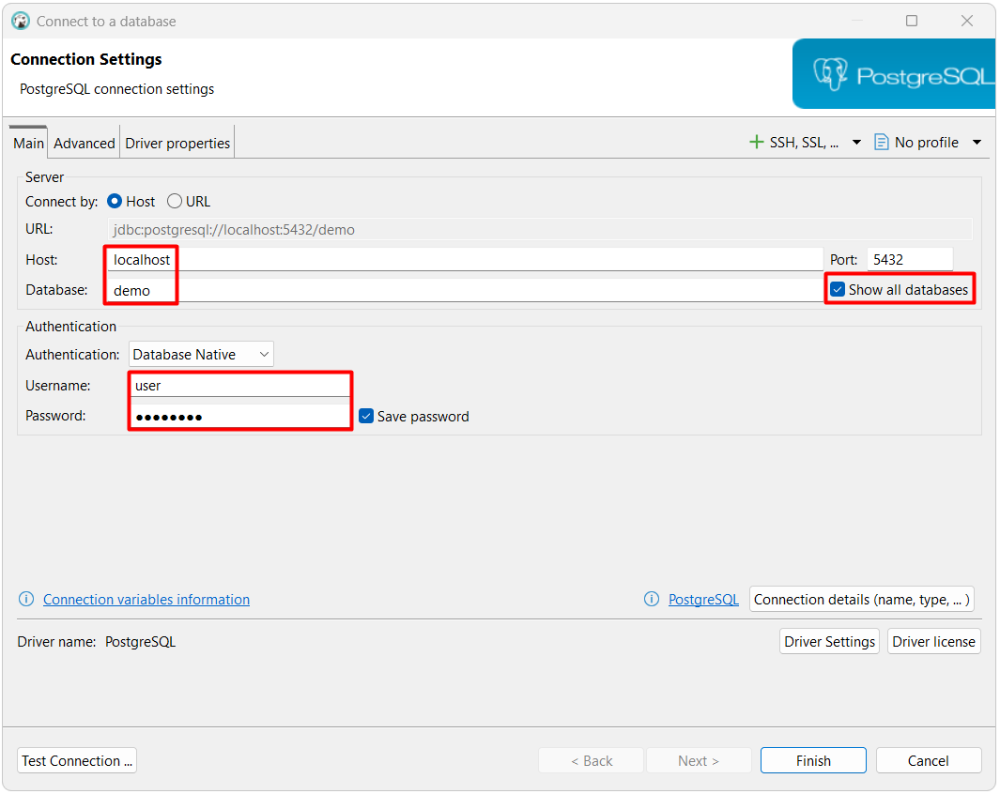

# notes-sql / postgres

- [Documentación oficial 18](https://www.postgresql.org/docs/18/index.html)
- Herramientas de administración
  - DBeaver (general)
    - [Documentación](https://dbeaver.com/docs/dbeaver/)
    - [Instalador](https://dbeaver.io/download/)
- "Cheat Sheet"
  - [LearnSQL.com](https://learnsql.com/blog/postgresql-cheat-sheet/postgresql-cheat-sheet-letter.pdf)
  - [tutorialspoint.com](https://www.tutorialspoint.com/postgresql/index.htm)
  - [geeksforgeeks.org](https://www.geeksforgeeks.org/postgresql/postgresql-tutorial/)

## Docker

- [Guía oficial e Imágenes](https://hub.docker.com/_/postgres)

### Ejecutar contenedor

El siguiente comando en PowerShell descargan la imagen.

```powershell
docker pull "postgres:18.0"
```

Los siguientes comandos en PowerShell crean y ejecutan el contenedor.

```powershell
#creación de carpeta base
New-Item -ItemType Directory -Force -Path "C:\Docker"

#creación de volúmenes en carpeta base
docker volume create "db-postgres-data" --opt o=bind --opt type=none --opt device="C:\Docker\db-postgres-data"

#creación y ejecución del contenedor
docker run --name "db-postgres" -p 5432:5432 -e "POSTGRES_USER=user" -e "POSTGRES_PASSWORD=DEMO123*" -e "POSTGRES_DB=demo" -v "db-postgres-data:/var/lib/postgresql" -d "postgres:18.0"
```

### Conectar

DBeaver

<p align="center">
  
</p>

### Base de datos de ejemplo

Los siguientes comandos en PowerShell crean la base de datos de ejemplo Chinook. Se debe descargar y cambiar la ruta del archivo sql.

```powershell
$container='db-postgres'
$connection_user='user'
Get-Content ".\examples\chinook\postgres.sql" | docker exec -i $container psql -h localhost -U $connection_user
```
